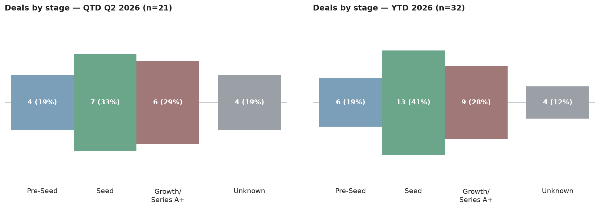
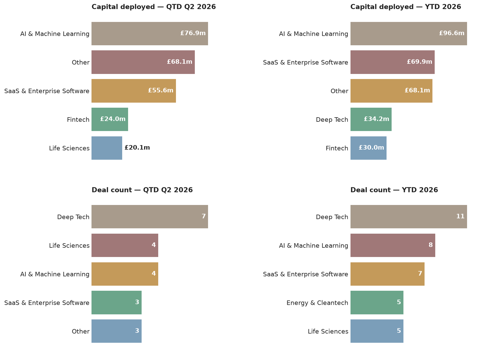

# Scottish Venture News — 29 June 2026

*This is an automated newsletter, written by Claude, based on news coverage scraped from 47 websites.*

---

## 1. This Week

No deals were announced this past week. All five records surfacing in this issue are backfill — older announcements that only appeared in monitored sources this week.

- **Aveni raises £12m** in a growth round led by PXN Ventures, with Puma Growth Partners, Lloyds Banking Group, Nationwide and Scottish Enterprise participating. The Edinburgh AI startup provides conduct-risk monitoring and compliance tooling for wealth management and banking firms. Announced 4 June, surfaced this week.

  *Source: [Edinburgh Innovations](https://edinburgh-innovations.ed.ac.uk/news/fintech-startup-aveni-announces-12m-raise), [Scottish Financial Review](https://scottishfinancialreview.com/2026/06/04/aveni-edinburgh-ai-wealth-startup-raises-12m/)*

- **Ardgowan Distillery secures £4.2m**, announced 4 June. Investor names were not disclosed in the source report. The Inverclyde-based distillery is developing its new whisky production facility, surfaced this week via The Spirits Business.

  *Source: [The Spirits Business](https://www.thespiritsbusiness.com/2026/06/ardgowan-gains-4-2m-investment/)*

- **Go Swag closes a $5m (~£3.7m) seed round** led by Mercia Asset Management, with Techstart Ventures participating. The Glasgow startup runs a tech platform for corporate gifting, counting Meta, Apple and Netflix among its clients. Announced 27 May, surfaced this week.

  *Source: [Crunchbase](https://www.crunchbase.com/discover/funding_rounds/e3120c30307a4df552a2e1c7559da4a2)*

- **Highway Data Systems receives £1.25m** from Maven Capital Partners via the Investment Fund for Scotland — described as the first deal through the Greater Glasgow Innovation Cluster. The Glasgow company automates quality assurance for road construction and asphalt. Announced 30 April, surfaced this week.

  *Source: [Maven Capital Partners](https://www.mavencp.com/latest-news/ifs-maven-equity-finance-invests-in-1.25-million-in-highway-data-systems)*

- **Regeno closes a seed round of undisclosed size**, led by SFC Capital and backed by Scottish Enterprise, One Planet Capital, Gabriel Investment Syndicate, British Business Bank and the University of Strathclyde. The Glasgow spinout is developing wind turbines serviceable from ground level, removing the need for large cranes. Announced 20 March, surfaced this week.

  *Source: [University of Strathclyde](https://www.strath.ac.uk/whystrathclyde/news/2026/strathclyde-supportedstart-upsecuresbackingtodeveloplower-costwindenergy/)*

---

## 2. The Numbers

**Q2 2026 stands at 21 deals and £123.9m invested.** These figures are revised upward from the 22 June issue: Q2 gains 2 deals and £16.4m, driven by Aveni's £12m raise and Ardgowan Distillery's £4.2m entering the ledger for the first time. **Year to date: 32 deals and £157.9m** — up 3 deals and the same £16.4m in capital, with Regeno's undisclosed March seed accounting for the one additional deal beyond the Q2 revision.

**Most active this quarter by deal count:**
- Tricapital — 4 deals (£2.8m)
- Scottish Enterprise Investment Fund — 3 deals (£22.7m)
- Maven Capital Partners — 2 deals (£3.9m); STAC Invest — 2 deals (£0.5m) — tied third

**Most active this quarter by capital deployed:**
- Index Ventures and Highland Europe — joint first, £51.9m each (both co-led the Wordsmith AI Series B)
- Scottish Enterprise Investment Fund — £22.7m across 3 deals

Q2's stage mix skews early: seven Seed rounds and four Pre-Seed account for more than half the deal count, alongside four Growth rounds and two Series B deals. The capital figures are heavily weighted by the single Wordsmith AI $70m Series B — strip that out and the remainder of Q2 is spread thinly across early-stage rounds. Deep Tech leads by deal count (seven of 21), while AI & Machine Learning commands the most capital — again, almost entirely from Wordsmith. Edinburgh accounts for seven Q2 deals, Other Scotland for nine, and Glasgow four, suggesting deal-making is distributed well beyond the capital even if the largest cheques tend to land there.

---

## 3. Deal Spotlight

### Aveni — Growth — £12m

**Lead investor**: PXN Ventures · **Co-investors**: Puma Growth Partners, Lloyds Banking Group, Nationwide, Scottish Enterprise Investment Fund · **Sector**: AI & Machine Learning, Fintech · **Location**: Edinburgh

University of Edinburgh spinout Aveni builds AI compliance and conduct-risk tooling for financial services — specifically the infrastructure regulated firms need as they deploy AI agents in client-facing roles. Its Unified Assurance Platform monitors financial advice quality in real time; newer products (Agent Assure and Agent Approve) assess the behaviour of AI agents in regulated settings. The £12m Growth round was led by PXN Ventures, with Puma Growth Partners returning alongside Lloyds Banking Group and Nationwide as new strategic investors, and Scottish Enterprise also participating. The presence of two of the UK's largest retail banks as co-investors — rather than customers — signals that Aveni is already embedded in infrastructure those banks depend on. Announced 4 June; appeared in monitored sources this week.

Source: [Edinburgh Innovations](https://edinburgh-innovations.ed.ac.uk/news/fintech-startup-aveni-announces-12m-raise), [Scottish Financial Review](https://scottishfinancialreview.com/2026/06/04/aveni-edinburgh-ai-wealth-startup-raises-12m/)

---

### Go Swag — Seed — $5m (~£3.7m)

**Lead investor**: Mercia Asset Management · **Co-investors**: Techstart Ventures · **Sector**: SaaS & Enterprise Software · **Location**: Glasgow

Glasgow-based Go Swag runs a tech-enabled platform for corporate gifting and branded merchandise, counting Meta, Apple, Netflix and ElevenLabs among more than 1,000 client companies. The $5m seed round, led by Mercia with Techstart Ventures participating, brings total funding to $6.2m and reflects an ambition to scale internationally from a Scottish base. Mercia manages the equity component of the Investment Fund for Scotland; Techstart is an active early-stage backer across the Scottish ecosystem. The combination suggests a deal with a deliberate Scottish growth mandate attached, despite the client list that leans heavily American. Announced 27 May; appeared in monitored sources this week.

Source: [Crunchbase](https://www.crunchbase.com/discover/funding_rounds/e3120c30307a4df552a2e1c7559da4a2)

---

## 4. Sources

- **Aveni**: [Edinburgh Innovations](https://edinburgh-innovations.ed.ac.uk/news/fintech-startup-aveni-announces-12m-raise), [Scottish Financial Review](https://scottishfinancialreview.com/2026/06/04/aveni-edinburgh-ai-wealth-startup-raises-12m/)
- **Ardgowan Distillery**: [The Spirits Business](https://www.thespiritsbusiness.com/2026/06/ardgowan-gains-4-2m-investment/)
- **Go Swag**: [Crunchbase](https://www.crunchbase.com/discover/funding_rounds/e3120c30307a4df552a2e1c7559da4a2)
- **Highway Data Systems**: [Maven Capital Partners](https://www.mavencp.com/latest-news/ifs-maven-equity-finance-invests-in-1.25-million-in-highway-data-systems)
- **Regeno**: [University of Strathclyde](https://www.strath.ac.uk/whystrathclyde/news/2026/strathclyde-supportedstart-upsecuresbackingtodeveloplower-costwindenergy/)

---

## 5. Notes

All five records in this issue are older announcements that only surfaced in monitored sources this week — the most recent is from 4 June, the oldest from 20 March. This reflects when coverage was found, not a gap in Scottish deal activity during the week of 22–29 June.

The Ardgowan Distillery figure (£4.2m) comes from a single trade publication, The Spirits Business. No investor names are identified in that report, so the deal appears in this issue without investor attribution.

Aveni's June round appears in two separate records in the underlying data: one from Edinburgh Innovations describing a Growth round with full investor detail, another from Crunchbase labelling the same £12m raise as a Series B without naming investors. Both reference the same date and amount and almost certainly describe the same transaction. The pair is flagged as a likely duplicate pending resolution; until that is closed, the deal is reflected once in the numbers above.
